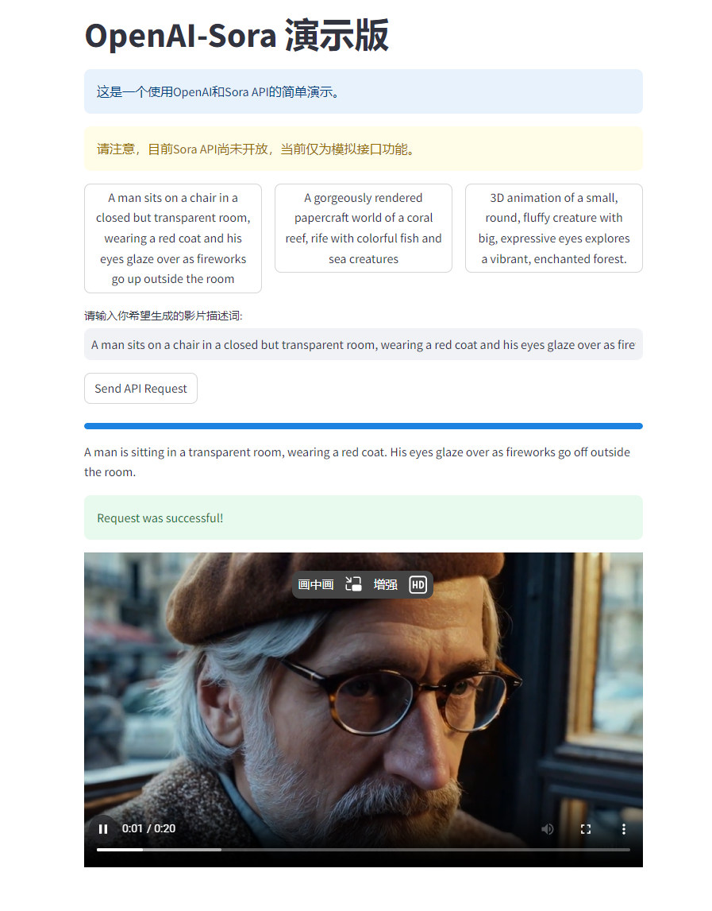

# Fake-Sora-Streamlit
 Fake Sora App based on Streamlit

# 欢迎使用 OpenAI-Sora 模拟系统

这个项目是一个使用 Streamlit 框架开发的 OpenAI-Sora 模拟系统的演示。该系统使用了 **[FakeSoraAPI](https://github.com/SoraWebui/FakeSoraAPI)** 作为请求接口，用于模拟 OpenAI-Sora 的功能。

[](https://opensource.org/licenses/MIT)
[](https://www.python.org/)
[](https://streamlit.io/)
[](https://openai.com/)


## 功能特性

- 模拟 OpenAI-Sora 的基本对话功能
- 展示了一些基本的自然语言处理技术
- 提供了一些示例对话场景

## 安装

1. 克隆这个仓库到本地机器：

```bash
git clone https://github.com/Xyy-tj/fake-sora-streamlit.git
```

2. 安装所需的依赖：

```bash
pip install -r requirements.txt
```

## 使用说明

运行以下命令启动 Streamlit 应用：

```bash
streamlit run app.py
```

然后访问 `http://localhost:8501` 查看演示系统。

## 示例截图



## 技术栈

- Python
- Streamlit
- FakeSoraApi

## 贡献

欢迎贡献代码，提出 issue 或者改进建议。

## 许可证

MIT License

---

希望这个示例可以帮助到你，如果有其他问题或者需要进一步的帮助，请随时告诉我。